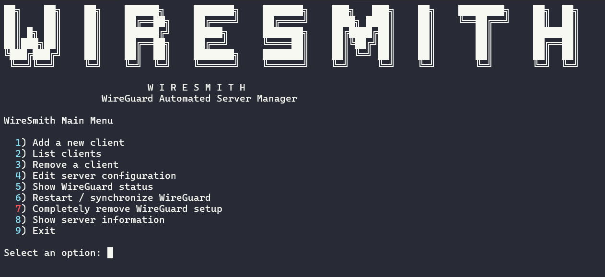

# WireSmith

**WireGuard Automated Server Manager**

WireSmith is an interactive Bash utility for setting up and managing a WireGuard VPN server on Linux.

It automates the repetitive parts of a WireGuard deployment — package installation, key generation, server/client configuration, IP allocation, IPv4 forwarding, UFW NAT/firewall rules, service startup, and client management — through a simple terminal menu.



## What does WireSmith solve?

Setting up WireGuard manually usually requires several separate steps:

* Installing the correct WireGuard packages
* Generating server and client keys
* Creating server and client configurations
* Assigning VPN addresses
* Enabling IP forwarding
* Configuring NAT and firewall rules
* Starting and enabling WireGuard at boot
* Keeping track of client configurations
* Safely modifying or removing the setup

WireSmith puts these operations behind one interactive CLI.

It is particularly useful when you want a **quick, repeatable WireGuard server setup without manually editing multiple configuration and firewall files**.

## Requirements

Run WireSmith as `root` on a supported Linux distribution.

Supported distributions:

* Debian / Ubuntu
* Fedora / RHEL-like distributions
* Arch Linux
* Alpine Linux

The script automatically detects the available package manager and installs the required dependencies when necessary.

## Installation

Clone the repository:

```bash
git clone https://github.com/YOUR_USERNAME/wiresmith.git
cd wiresmith
```

Make the script executable:

```bash
chmod +x wiresmith.sh
```

Run it as root:

```bash
sudo ./wiresmith.sh
```

Or:

```bash
sudo bash wiresmith.sh
```

## First-time setup

If no WireGuard server exists, WireSmith will offer to create one.

You will be asked for:

1. **VPN server address**

   Example:

   ```text
   10.8.0.1/24
   ```

2. **WireGuard UDP port**

   Default:

   ```text
   51820
   ```

3. **WAN interface**

   WireSmith attempts to detect this automatically, for example:

   ```text
   eth0
   ens3
   enp1s0
   ```

4. **Server public endpoint**

   This is the public IP address or DNS hostname clients use to connect.

   Example:

   ```text
   vpn.example.com
   ```

5. **First client**

   You will choose:

   * Client name
   * Client VPN address
   * Allowed IPs
   * DNS server

WireSmith then generates the keys and configuration, configures forwarding/NAT, starts WireGuard, and enables it at boot.

The generated client configuration is stored under:

```text
/root/wireguard-clients/
```

For example:

```text
/root/wireguard-clients/laptop.conf
```

**Treat client `.conf` files as private credentials.** They contain the client's private key.

## Managing an existing server

Run WireSmith again after the initial setup:

```bash
sudo ./wiresmith.sh
```

If `/etc/wireguard/wg0.conf` exists, WireSmith detects it and enters management mode.

From there you can:

* Add clients
* List configured clients
* Remove clients
* Edit the VPN subnet
* Change the WireGuard UDP port
* View WireGuard status
* Restart/synchronize WireGuard
* View server information
* Completely remove the WireGuard setup

### Adding a client

Choose:

```text
1) Add a new client
```

Enter a client name such as:

```text
laptop
phone
windows-pc
```

WireSmith generates a new key pair and creates the client configuration.

### Listing clients

Choose:

```text
2) List clients
```

This displays the configured client names, public keys, and VPN addresses.

### Removing a client

Choose:

```text
3) Remove a client
```

Select the client and confirm the removal.

WireSmith creates a backup of the server configuration before modifying it.

### Editing the server

Choose:

```text
4) Edit server configuration
```

You can change:

* VPN server IP/subnet
* WireGuard UDP port

Backups are created before modifications.

> Changing the VPN subnet requires existing client configurations to be updated.

### Checking status

Choose:

```text
5) Show WireGuard status
```

This displays the active WireGuard interface and peer information.

### Restarting WireGuard

Choose:

```text
6) Restart / synchronize WireGuard
```

WireSmith will restart the systemd service when available, or bring the interface down/up directly.

## Removing the setup

Choose:

```text
7) Completely remove WireGuard setup
```

WireSmith will ask for confirmation before removing the setup.

It removes the WireSmith-managed:

* `wg0` interface
* Server configuration
* Client configurations
* IPv4 forwarding configuration
* UFW NAT configuration
* WireGuard startup configuration

Before destruction, it creates a backup of the server configuration.

You are then given the option to remove the WireGuard software packages as well.

## Configuration locations

| Purpose               | Location                                     |
| --------------------- | -------------------------------------------- |
| WireGuard server      | `/etc/wireguard/wg0.conf`                    |
| Client configurations | `/root/wireguard-clients/`                   |
| IPv4 forwarding       | `/etc/sysctl.d/99-wireguard-forwarding.conf` |
| UFW rules             | `/etc/ufw/before.rules`                      |

Configuration backups are created alongside modified files with a timestamped `.backup.*` suffix.

## Security notes

WireSmith runs with root privileges because WireGuard, networking, firewall, and system configuration require administrative access.

Keep these files protected:

```text
/etc/wireguard/wg0.conf
/root/wireguard-clients/*.conf
```

In particular, **never share a client configuration containing its `PrivateKey`**.

WireSmith uses restrictive permissions (`600` for configuration files and `700` for its configuration directories).

## License

Add your preferred license here, for example:

```text
MIT License
```
